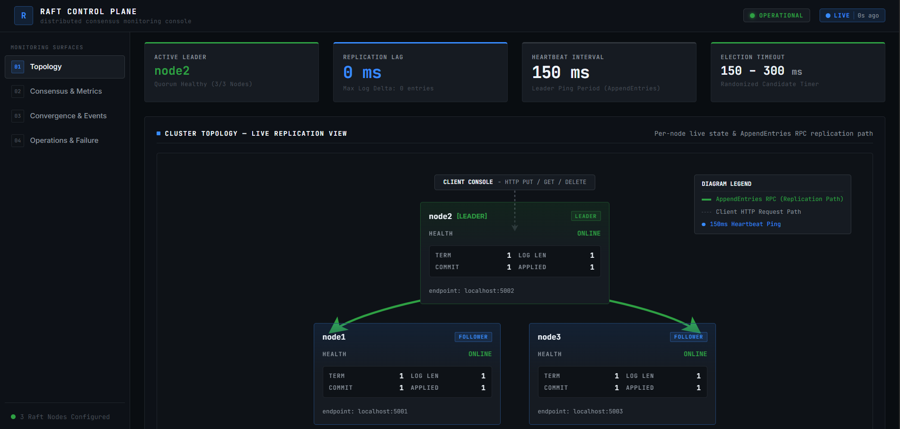
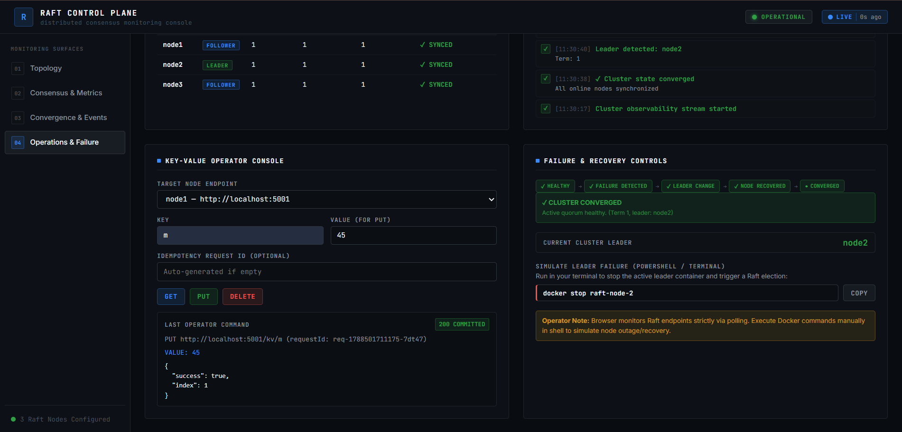
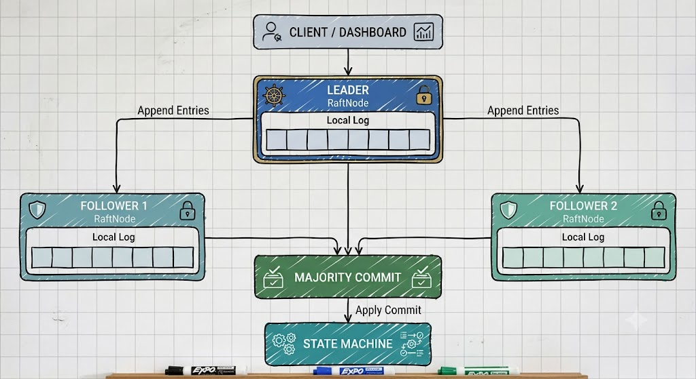
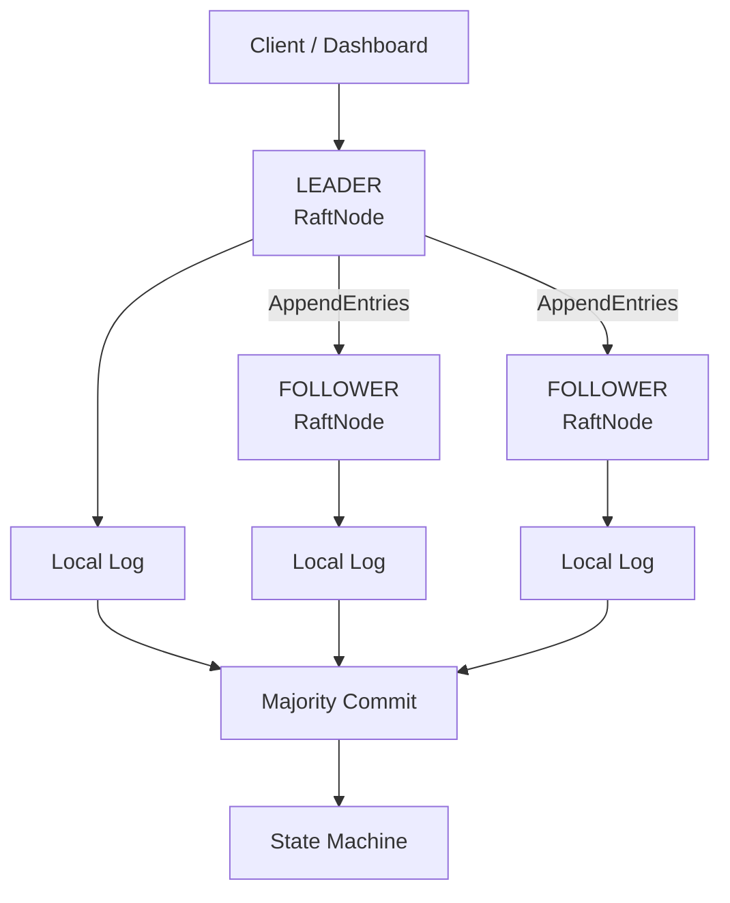

# Raft Consensus Implementation

A fault-tolerant distributed key-value store built around a from-scratch Raft implementation. The project runs a Dockerized three-node cluster with leader election, replicated logs, majority-based commitment, state-machine application, JSON-file persistence, failure recovery, and a React monitoring dashboard.

The implementation is designed as an engineering demonstration of consensus, quorum behavior, persistence, concurrency, and observability. It is not presented as a production-ready consensus service.

## Screenshots

### Raft Topology



### Replication & Consensus Pipeline


### Operations & Failure Recovery



### Replication Flow



## Overview

Distributed nodes need a way to agree on an ordered sequence of state changes even when individual nodes fail. This project uses Raft's leader-based model:

- Followers start an election after an election timeout.
- A candidate requests votes and becomes leader only with a majority.
- Clients submit key-value writes to the leader.
- The leader replicates log entries with `AppendEntries`.
- An entry is committed after majority replication and then applied to the state machine.
- A recovered node backtracks and catches up from the current leader.

The cluster has fixed membership of three nodes. Each node persists Raft state and state-machine data under its own Docker volume.

## Key Features

- Three-node Raft cluster with `FOLLOWER`, `CANDIDATE`, and `LEADER` states.
- `RequestVote` elections with log up-to-date checks and term changes.
- `AppendEntries` heartbeats and log replication.
- Majority-based commitment with `commitIndex` and sequential `lastApplied` application.
- Serialized leader write queue for key-value mutations.
- Follower-to-leader forwarding for KV requests when a leader is known.
- `SET` and `DELETE` state-machine commands.
- Optional request IDs for idempotent `SET` and `DELETE` retries.
- Conflicting follower log repair and catch-up after rejoining.
- JSON-file persistence for Raft state and application data.
- Graceful shutdown handling for `SIGTERM` and `SIGINT`.
- React/Vite dashboard with health, metrics, topology, replication, convergence, events, KV operations, and failure-recovery guidance.
- Existing k6 workloads for writes, reads, follower forwarding, mixed traffic, and idempotency.

## Architecture



## Component Architecture

| Component | Responsibility |
| --- | --- |
| `src/raft/RaftNode.ts` | Raft state, elections, terms, voting, leader behavior, replication, commit advancement, and state-machine application. |
| `src/raft/ElectionTimer.ts` | Randomized election timeout and timer reset/stop behavior. |
| `src/raft/rpc.ts` | TypeScript contracts for `RequestVote` and `AppendEntries` messages. |
| `src/raft/types.ts` | Node states and replicated log-entry types. |
| `src/state-machine/StateMachine.ts` | Applies `SET` and `DELETE` commands and tracks processed request IDs. |
| `src/state-machine/DataStorage.ts` | Persists application key-value data in `actual-data.json`. |
| `src/storage/FileStorage.ts` | Persists Raft term, vote, log, commit index, and applied index in `raft-state.json`. |
| `src/app.ts` | Express API, leader forwarding, HTTP status mapping, and internal Raft routes. |
| `frontend/src` | React dashboard that polls each node every two seconds. |

## How Raft Works

### Leader Election

A node begins as a follower. If it does not receive heartbeats before its randomized election timeout, it becomes a candidate, increments its term, votes for itself, and sends `RequestVote` to its peers. A candidate becomes leader after receiving the configured majority. A node receiving a higher term updates its term and returns to follower state.

The default election timeout is randomized between 1.5 and 3 seconds. Leader heartbeats are sent every 500 ms by default.

### Log Replication

A leader appends a `SET` or `DELETE` entry to its local log and sends it to followers in `AppendEntries` messages. Followers validate the previous log index and term, truncate conflicting suffixes when necessary, and append missing entries. Replication sends at most 64 entries per request and retries failed peer replication using the configured retry limit.

### Commit and State Machine

The leader advances `commitIndex` after a majority has replicated an entry, subject to the current-term commit rule. Committed entries are applied in order until `lastApplied` reaches `commitIndex`:

```text
client write
  -> leader log
  -> AppendEntries replication
  -> majority acknowledgement
  -> commitIndex
  -> state machine
```

### Failure Recovery

When a leader stops, surviving followers stop receiving heartbeats and may start an election. A new leader can continue committing writes with a majority. When the failed node returns, the leader uses `nextIndex` backtracking to repair and catch up its log. The dashboard reports node availability and convergence based on observed node metrics.

## API

The backend exposes the following routes on every node. KV requests sent to a follower are forwarded to the known leader and the leader's response status and body are preserved.

### `GET /health`

Returns the node's current identity and Raft role.

```json
{
  "nodeId": "node1",
  "state": "FOLLOWER",
  "term": 2,
  "leaderId": "node2"
}
```

Returns `200` when the node process is reachable.

### `GET /metrics`

Returns node counters and current Raft indexes.

```json
{
  "electionsStarted": 1,
  "leaderChanges": 1,
  "replicationFailures": 0,
  "entriesCommitted": 4,
  "currentTerm": 2,
  "state": "LEADER",
  "commitIndex": 4,
  "lastApplied": 4,
  "logLength": 4
}
```

Returns `200`.

### `PUT /kv/:key`

Stores or updates a value through the leader.

Request body:

```json
{
  "value": "hello-raft",
  "requestId": "optional-client-request-id"
}
```

Success response:

```json
{
  "success": true,
  "index": 1
}
```

Important statuses:

- `200`: the entry was committed successfully.
- `400`: the key or value is missing.
- `503`: no usable leader, leadership could not be confirmed, or a majority commit was not achieved.

### `GET /kv/:key`

Reads a value through the leader. Missing keys return `200` with a `null` value.

```json
{
  "success": true,
  "leader": "node2",
  "value": "hello-raft"
}
```

A node may return `503` when no leader is known or the leader cannot confirm its authority with a majority.

### `DELETE /kv/:key`

Deletes an existing key. The optional request ID makes retries idempotent.

Request body:

```json
{
  "requestId": "optional-client-request-id"
}
```

Success response:

```json
{
  "success": true,
  "index": 2
}
```

A missing key returns `404`:

```json
{
  "success": false,
  "index": -1,
  "error": "Key not found",
  "key": "missing-key"
}
```

Other statuses include `400` for a missing path key and `503` when a leader or majority is unavailable.

### Internal Raft routes

These routes are used for node-to-node communication:

- `POST /internal/request-vote` accepts `term`, `candidateId`, `lastLogIndex`, and `lastLogTerm`; it returns `term` and `voteGranted`.
- `POST /internal/append-entries` accepts `term`, `leaderId`, `prevLogIndex`, `prevLogTerm`, `entries`, and `leaderCommit`; it returns `term` and `success`.

The HTTP layer does not authenticate these internal routes, so they should not be exposed as an unrestricted public API.

## Docker Architecture

`docker-compose.yml` defines three services on the Docker network:

| Service | Container | Host endpoint | Node ID | Persistent volume |
| --- | --- | --- | --- | --- |
| `node1` | `raft-node-1` | `localhost:5001` | `node1` | `node1-data` |
| `node2` | `raft-node-2` | `localhost:5002` | `node2` | `node2-data` |
| `node3` | `raft-node-3` | `localhost:5003` | `node3` | `node3-data` |

The image uses Node 22 Alpine. Production containers run as a non-root `appuser` and execute the compiled backend from `dist/`.

## Project Structure

```text
.
├── src/
│   ├── app.ts
│   ├── index.ts
│   ├── node/
│   ├── raft/
│   ├── state-machine/
│   └── storage/
├── tests/
│   ├── kv-api.test.ts
│   ├── raft-cluster.test.ts
│   ├── raft-consistency.test.ts
│   ├── raft-election.test.ts
│   ├── raft-failure.test.ts
│   ├── state-machine.test.ts
│   └── storage.test.ts
├── frontend/
│   ├── src/
│   ├── index.html
│   ├── package.json
│   └── vite.config.ts
├── k6/
│   ├── basic-write.js
│   ├── concurrent-get.js
│   ├── concurrent-idempotency.js
│   ├── concurrent-set.js
│   ├── follower-forward.js
│   └── mixed-workload.js
├── Dockerfile
├── docker-compose.yml
├── package.json
└── tsconfig.json
```

## Prerequisites

- Node.js 22 or a compatible current Node.js runtime.
- npm.
- Docker Desktop with Docker Compose.
- k6 is required only for the load-test commands.

No `.env` file is used by the repository. Node configuration is supplied through environment variables or Docker Compose.

## Installation

Install backend dependencies from the repository root:

```bash
npm ci
```

Install frontend dependencies separately:

```bash
cd frontend
npm ci
cd ..
```

## Running the Cluster

Build and start all three nodes:

```bash
docker compose up --build -d
```

Inspect the containers:

```bash
docker ps
```

Check a node directly:

```bash
curl.exe http://localhost:5001/health
curl.exe http://localhost:5001/metrics
```

Stop the cluster while preserving named volumes:

```bash
docker compose down
```

Do not use `docker compose down -v` for normal shutdown; removing volumes also removes persisted node state and application data.

### Running a node directly

The backend reads these required environment variables:

```text
NODE_ID=node1
PORT=5001
PEERS=node2:5002,node3:5003
```

Run the TypeScript development process with:

```bash
NODE_ID=node1 PORT=5001 PEERS=node2:5002,node3:5003 npm run dev
```

On PowerShell, set the variables first with `$env:NODE_ID = "node1"`, `$env:PORT = "5001"`, and `$env:PEERS = "node2:5002,node3:5003"`. Direct execution uses `/app/data` as the storage directory; Docker Compose is the intended multi-node setup.

## Running the Dashboard

Start the Vite development server:

```bash
cd frontend
npm run dev
```

Open [http://localhost:3000](http://localhost:3000/). The backend CORS configuration allows this origin.

The dashboard polls all three nodes every two seconds and displays:

- cluster health, current leader, and term
- per-node role and availability
- commit index, last applied index, and log length
- Raft topology and replication state
- convergence status
- detected leader, role, availability, and convergence events
- KV `GET`, `PUT`, and `DELETE` operations
- manual failure and recovery commands for the observed leader

The browser only displays and copies Docker commands. It never executes them.

## KV Store Demo

Identify the current leader from `/health`, then use its host port. The follower routes also forward requests when they know the leader.

```powershell
curl.exe -X PUT http://localhost:<leader-port>/kv/test `
  -H "Content-Type: application/json" `
  -d '{"value":"hello-raft","requestId":"demo-put-1"}'

curl.exe http://localhost:<leader-port>/kv/test

curl.exe -X DELETE http://localhost:<leader-port>/kv/test
```

A second delete of `test`, or a delete of a key that does not exist, returns `404` with `error: "Key not found"`. A request ID can be reused to receive the same result for an already processed mutation.

## Failure and Recovery Demo

1. Open the dashboard at `http://localhost:3000`.
2. Identify the current leader from the header, topology, or `/health`.
3. Copy the displayed command and run it manually, replacing `X` with the actual leader number:

   ```powershell
   docker stop raft-node-X
   ```

4. Observe the stopped node become unavailable and the remaining majority elect a new leader.
5. Send a write to the new leader if desired.
6. Start the exact container that was stopped:

   ```powershell
   docker start raft-node-X
   ```

7. Observe the node return as a follower, catch up through replication, and converge with the cluster.

The dashboard does not control Docker or perform failure injection itself.

## Testing

Run the backend build and test suite from the repository root:

```bash
npm run build
npm test
```

The seven Vitest files cover:

- HTTP KV operations, leader forwarding, status handling, and request-id idempotency.
- Leader election, voting, term changes, and log freshness.
- Cluster replication, majority commit, retry behavior, catch-up, conflict repair, and restart state restoration.
- Concurrent write consistency.
- Leader and follower failure recovery, majority loss, partitions, and clean shutdown.
- State-machine CRUD behavior.
- File persistence, overwrite behavior, missing state, and corrupted JSON handling.

The frontend has a build but no frontend test script:

```bash
cd frontend
npm run build
```

## Load Testing

The `k6/` directory contains existing workloads:

```bash
k6 run k6/basic-write.js
k6 run k6/concurrent-set.js
k6 run k6/concurrent-get.js
k6 run k6/concurrent-idempotency.js
k6 run k6/follower-forward.js
k6 run k6/mixed-workload.js
```

The scripts exercise:

- basic writes against node 2
- concurrent writes
- concurrent reads
- repeated request IDs for idempotency
- writes sent through a follower
- an 80% read / 20% write mixed workload

The scripts use fixed endpoints and do not perform an automatic leader lookup. Under heavy concurrent writes, client-level `503` responses can occur while the replicated cluster may still converge. Load-test results should therefore report request failures rather than treating eventual convergence as proof that every client request was acknowledged successfully.

## Observability

`GET /health` exposes:

- `nodeId`
- `state`
- `term`
- `leaderId`

`GET /metrics` exposes:

- `electionsStarted`: elections started by the node.
- `leaderChanges`: leader transitions recorded by the node.
- `replicationFailures`: failed replication attempts recorded by the node.
- `entriesCommitted`: committed entries counted by the node.
- `currentTerm`: current Raft term.
- `state`: current node role.
- `commitIndex`: highest log index known to be committed.
- `lastApplied`: highest committed index applied to the state machine.
- `logLength`: number of log entries currently held by the node.

The dashboard polls these endpoints directly for all three node ports and derives cluster-level status and convergence from the returned values.

## Consistency and Guarantees

The implementation provides the following behavior within its implemented model:

- A leader requires a majority to advance commitment for a write.
- Committed entries are applied to the state machine in log order.
- Followers reject inconsistent previous-log positions and can repair conflicting suffixes.
- Writes are serialized through the leader's write queue.
- Followers forward KV requests to their known leader rather than applying writes independently.
- Request IDs support idempotent retry handling for `SET` and `DELETE` operations while processed-request records are available.
- Persisted term, vote, log, commit index, last-applied index, and state-machine data are restored on restart.

These are implementation-level guarantees, not a claim of production-grade linearizability or exactly-once processing under every failure mode. The project does not provide a formal proof of all client-observable guarantees.

## Known Limitations

- Cluster membership is fixed at three nodes; there is no dynamic membership protocol.
- There is no snapshotting or log compaction, so logs grow with committed operations.
- Persistence is JSON-file based and uses ordinary file writes rather than an atomic write-ahead storage layer.
- Internal Raft HTTP routes have no authentication or peer authorization.
- The API has no TLS or user authentication.
- The dashboard uses polling rather than WebSockets and depends on the fixed local node ports.
- The k6 scripts use fixed node endpoints and can observe occasional `503` responses during concurrency or leadership transitions.
- There is no automated Docker failure injection; the dashboard provides commands for a user to run manually.
- The frontend is a development Vite application; Docker Compose defines the backend nodes, not a frontend production service.

## What This Project Demonstrates

- Distributed consensus and quorum reasoning.
- Leader election and failure detection.
- Replicated logs and state machines.
- Majority-based commit advancement.
- Concurrency control and idempotent request handling.
- Persistent state and node restart recovery.
- Dockerized multi-node systems.
- HTTP API design and follower forwarding.
- Operational observability and convergence monitoring.
- Fault-recovery testing and k6 workload analysis.

## Technology Stack

| Layer | Technology |
| --- | --- |
| Backend runtime | Node.js 22 |
| Language | TypeScript |
| HTTP API | Express 5 |
| Persistence | JSON files through Node filesystem APIs |
| Consensus | Custom Raft implementation |
| Frontend | React 18 + TypeScript |
| Frontend tooling | Vite 5 |
| Containerization | Docker and Docker Compose |
| Backend testing | Vitest + Supertest |
| Load testing | k6 |

## License

No `LICENSE` file is included in the repository. The root `package.json` contains an `ISC` license metadata field; consult the repository owner before redistributing the project under a formal license.
